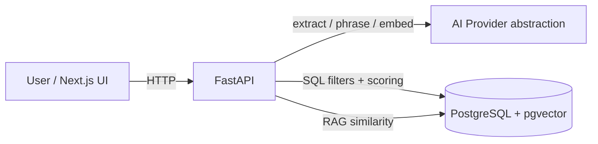

# AutoAI

Independent proof-of-concept **AI car buying assistant** for Pakistan's automotive market.

> **Independent proof of concept — not affiliated with or endorsed by PakWheels.**

Architecture and scope live in [`PLANNING.md`](./PLANNING.md). Privacy: [`docs/PRIVACY.md`](./docs/PRIVACY.md). Deployment notes: [`docs/DEPLOYMENT.md`](./docs/DEPLOYMENT.md).

---

## What it does

Natural-language requirements → structured extraction → deterministic search & scoring → comparison → optional listing analysis → separate RAG knowledge Q&A.

**Principle (Section B):** the LLM only does language/orchestration. Search, scoring, comparison, and price assessment are backend-deterministic and testable.

---

## Architecture



| Layer | Responsibility |
|---|---|
| Frontend | Chat UX, recommend/compare, listing analyzer, knowledge ask |
| Backend | Auth-ready API, validation, rate limits, logging, tools |
| DB | Vehicles, conversations, knowledge chunks |
| LLM | Requirement/listing extraction, grounded phrasing only |

---

## Stack

| Layer | Tech |
|---|---|
| Frontend | Next.js + TypeScript, Tailwind, shadcn/ui, Lucide |
| Backend | Python + FastAPI |
| Database | PostgreSQL, SQLModel/SQLAlchemy, Alembic, **pgvector** (RAG) |

---

## Repository layout

```
AI_BOT/
├── PLANNING.md
├── README.md
├── docker-compose.yml
├── docs/                 # privacy, deployment, screenshots
├── frontend/             # Next.js
└── backend/
    ├── app/              # api, ai, core, models, services, knowledge, scripts
    ├── alembic/
    ├── Dockerfile
    └── tests/
```

---

## Prerequisites

- Node.js 20+ and npm
- Python 3.10+
- PostgreSQL 14+ (**18 recommended**); **pgvector** required for knowledge Q&A
- An OpenRouter or OpenAI API key for LLM features

---

## Quick start (fresh clone)

### 1. Database

Use any Postgres instance, or a project-local cluster on port **5433**:

```bash
initdb -D backend/.pgdata -U postgres --auth-local=trust --auth-host=trust --encoding=UTF8 --locale=C
pg_ctl -D backend/.pgdata -l backend/.pgdata/server.log -o "-p 5433" start
createdb -h 127.0.0.1 -p 5433 -U postgres autoai
```

Enable pgvector (see [`backend/docs/PGVECTOR_WINDOWS.md`](./backend/docs/PGVECTOR_WINDOWS.md) on Windows):

```sql
CREATE EXTENSION IF NOT EXISTS vector;
```

Or with Docker Compose (includes pgvector image):

```bash
docker compose up -d db
```

### 2. Backend

```bash
cd backend
python -m venv .venv
# Windows: .\.venv\Scripts\activate
# macOS/Linux: source .venv/bin/activate
pip install -r requirements.txt
cp .env.example .env   # Windows: copy .env.example .env
# Set OPENROUTER_API_KEY (or OPENAI_*) in .env
alembic upgrade head
python -m app.scripts.seed_vehicles --clear
python -m app.scripts.ingest_knowledge   # automotive + buying-advice chunks
uvicorn app.main:app --reload --host 0.0.0.0 --port 8000
```

- Health: http://localhost:8000/health  
- OpenAPI: http://localhost:8000/docs  

### 3. Frontend

```bash
cd frontend
cp .env.example .env.local   # Windows: copy .env.example .env.local
npm install
npm run dev
```

- App: http://localhost:3000  

---

## Environment variables

### Backend (`backend/.env` — never commit)

| Variable | Purpose |
|---|---|
| `DATABASE_URL` | Sync Postgres URL |
| `DATABASE_URL_ASYNC` | Async URL (reserved) |
| `CORS_ORIGINS` | Allowed frontend origins |
| `AI_PROVIDER` | `openrouter` or `openai` |
| `OPENROUTER_API_KEY` / `OPENAI_API_KEY` | Provider secrets |
| `OPENROUTER_MODEL` / `OPENAI_MODEL` | Chat model ids |
| `EMBEDDING_MODEL` | Embedding model for RAG |
| `RAG_TOP_K` / `RAG_MIN_SIMILARITY` | Retrieval knobs |
| `RATE_LIMIT_PER_MINUTE` | AI-adjacent endpoint limit (default 30) |
| `LLM_MAX_RETRIES` / `LLM_RETRY_BACKOFF_SECONDS` / `LLM_TIMEOUT_SECONDS` | Reliability |
| `CONVERSATION_RETENTION_DAYS` | Privacy purge window (default 30) |
| `DEBUG` | Verbose SQL logs when true |

### Frontend (`frontend/.env.local`)

| Variable | Purpose |
|---|---|
| `NEXT_PUBLIC_API_URL` | Backend base URL (e.g. `http://localhost:8000`) |

Templates: `backend/.env.example`, `frontend/.env.example`.

---

## API overview

| Method | Path | Notes |
|---|---|---|
| `GET` | `/health` | Liveness |
| `GET` | `/api/vehicles/search` | Deterministic filters |
| `POST` | `/api/vehicles/recommend` | Weighted scoring (no LLM) |
| `POST` | `/api/vehicles/compare` | DB factors + optional LLM narrative |
| `POST` | `/api/chat/extract` | LLM extract + conversation memory |
| `POST` | `/api/chat/reset` | Clear session requirements |
| `POST` | `/api/listings/analyze` | LLM extract + deterministic price/red flags |
| `POST` | `/api/knowledge/ask` | RAG over sample knowledge only |

**Rate limited:** extract, compare, listing analyze, knowledge ask (and chat session helpers).  
**Errors:** JSON `{ "detail": "..." }` — LLM outages return a friendly retry message, not stack traces.

---

## Database schema (overview)

| Table | Role |
|---|---|
| `vehicles` | Demo catalog (make/model/year/price/city/…) |
| `conversations` / `messages` | Anonymous session memory |
| `knowledge_chunks` | Embedded educational text (`vector(1536)` + HNSW) |

---

## Production polish (Phase 8)

- Global exception handlers + friendly LLM failures / retries / timeouts  
- Sliding-window rate limiting on AI-adjacent routes  
- Structured JSON logging (requests, LLM failures, approximate token/cost)  
- Conversation retention purge: `python -m app.scripts.purge_old_conversations`  
- Docker: `backend/Dockerfile`, `frontend/Dockerfile`, root `docker-compose.yml`  

---

## Tests

```bash
cd backend
pytest -q
```

Offline suites cover search filters, extraction schemas, recommendation, comparison, memory, listing scoring, RAG don’t-know path, and production polish checks.

---

## Screenshots

- Listing analyzer: [`docs/screenshots/listing-analyzer.png`](./docs/screenshots/listing-analyzer.png)  
- Knowledge ask: [`docs/screenshots/knowledge-ask.png`](./docs/screenshots/knowledge-ask.png)  

---

## Known limitations

- Demo/sample vehicle data — **not** live market inventory; **not scraped**  
- Price comparisons use the reference dataset only  
- Knowledge base is small and educational — not mechanical/financial advice  
- Rate limits are process-local (fine for single-instance PoC)  
- No authentication yet (future / Phase 8+)  
- Windows pgvector may need a one-time extension install  

---

## Roadmap

| Status | Phase |
|---|---|
| Done | 1 Foundation → 5 Comparison + memory |
| Done | Listing analyzer + RAG knowledge |
| Done | Phase 8 production polish (this README) |
| Later | Auth, live authorized listings, finance/inspection assistants, mobile |

---

## License / disclaimer

Independent educational proof of concept. **Not affiliated with or endorsed by PakWheels.** Do not present AutoAI as an official PakWheels product.
